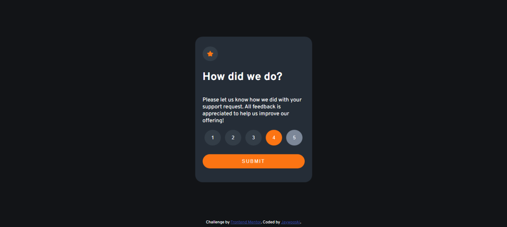

# Interactive-Rating-Comp
  ## Description 
  This project broadcasts my ability to use HTML, CSS, and JavaScript with basic knowledge and understanding. This project is brought to you by [frontendmentor.io](frontendmentor.io)
I enjoyed this project a lot. Brought me back to humble beginnings with the basic uses of coding.
  
  ## Table of Contents
  * [Description](#description)
  * [Table Of Contents](#table-of-contents)
  * [Installation](#installation)
  * [Usage](#usage)
  * [Collaborations](#collaborations)
  * [License](#license)
  * [Features](#features)
  * [Contributors](#contributors)
  * [Tests](#tests)
  * [Questions](#questions)
  
  ## Installation
  In order to install this project, clone the repo into the desired folder of your choosing and run the project over a live server for live editing. You can view the official finished project on the published site page.
  
  ## Usage
  Use this project as a reference to your own version.

  # License
   - This project uses a [MIT](https://choosealicense.com/license/mit/) license. For more information click the link.
   - 
   

  ## Features
  Be sure to check back if any features are added on... probably not though!
  
  
  

  ## Contributors
  You may use this how you'd like as I got this activity from a free open source site: [frontendmentor.io](frontendmentor.io)
  
 

  ## Questions
  For further questions, you can reach me at [john.m.wooley@gmail.com](john.m.wooley@gmail.com) .
  You may also view some of my other projects at my github page: [jaywooski](https://github.com/jaywooski).
  